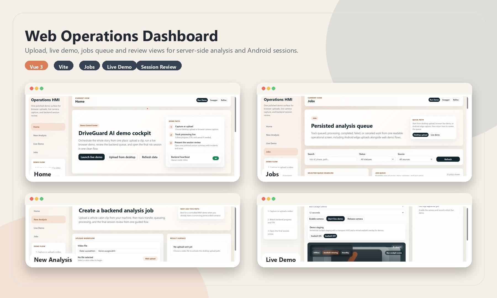
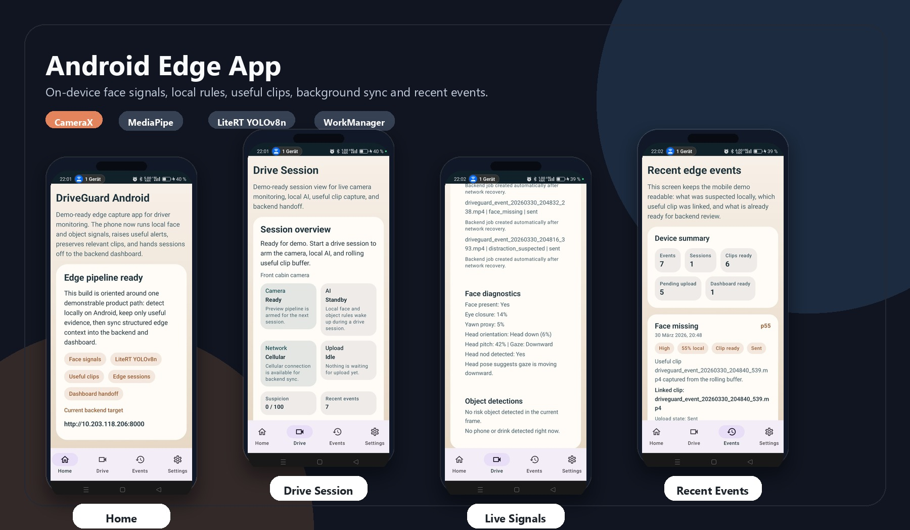
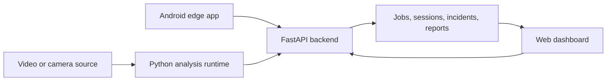
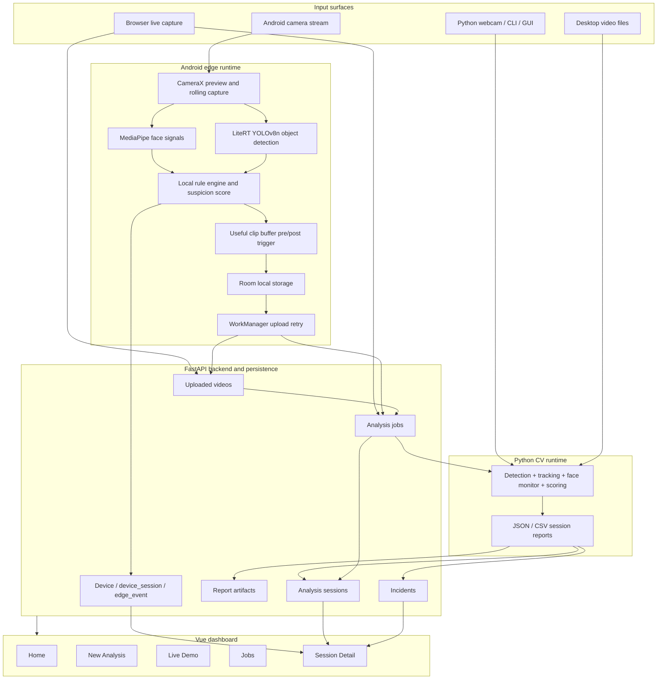

# DriveGuard AI

DriveGuard AI is a multi-surface driver monitoring prototype.

It combines:

- a Python computer-vision runtime for webcam and offline video analysis
- a FastAPI backend for uploads, jobs, sessions, incidents, and artifacts
- a Vue 3 dashboard for demo, review, and job tracking
- an Android edge app that performs local risk detection and only uploads useful clips

The project is built as a product prototype, not as a production fleet platform.
Its goal is to demonstrate the full chain:

- detect risky behavior locally or from uploaded video
- persist analysis and progress in a backend
- review results in a browser dashboard
- push Android edge events into the same backend and review flow

## Product Preview

The repository already includes two presentable product surfaces: a web operations dashboard and an Android edge app.

<table>
  <tr>
    <td align="center" width="50%">
      
      <br />
      <strong>Web dashboard</strong>
      <br />
      Upload, live demo, jobs queue, and review screens.
    </td>
    <td align="center" width="50%">
      
      <br />
      <strong>Android edge app</strong>
      <br />
      On-device monitoring, local alerts, useful clips, and background sync.
    </td>
  </tr>
</table>

## What The Project Actually Does

Today the repository can:

- analyze cabin video with YOLOv8, tracking, face monitoring, and rule-based incident logic
- score a driver session and export JSON / CSV artifacts
- accept uploaded videos through a backend API
- create asynchronous analysis jobs and persist their results
- display jobs, sessions, incidents, and source provenance in a web dashboard
- run on Android with CameraX, MediaPipe, LiteRT, local risk rules, and useful clip extraction
- sync Android edge sessions and edge events into the backend for later review

Typical risk signals and events currently covered:

- phone use
- distraction / off-road attention
- drowsiness
- yawning
- face missing
- seatbelt-related signals in the Python pipeline
- local Android object-assisted suspicion such as phone + gaze down

## Main Components

### 1. Python runtime

Located mainly in `driver_monitoring/`.

This is the original CV core of the project. It handles:

- video ingestion
- YOLO detection
- tracking
- face analysis
- event generation
- scoring
- report export

Key files:

- `driver_monitoring/pipeline.py`
- `driver_monitoring/event_engine.py`
- `driver_monitoring/runner.py`
- `driver_monitoring/gui.py`
- `driver_monitoring/cli.py`

### 2. FastAPI backend

The backend persists uploaded videos, analysis jobs, sessions, incidents, artifacts, and Android edge context.

Key files:

- `driver_monitoring/api.py`
- `driver_monitoring/backend/models.py`
- `driver_monitoring/backend/services.py`
- `driver_monitoring/backend/jobs.py`

### 3. Web dashboard

Located in `apps/driveguard-web/`.

This is the browser HMI for:

- desktop file upload
- browser live demo
- job monitoring
- session review
- Android edge summary review

### 4. Android edge app

Located in `apps/driveguard-android/`.

This is the on-device demo client. It currently supports:

- CameraX preview
- MediaPipe face signals
- LiteRT YOLOv8n mobile object detection
- local rule engine
- rolling pre-trigger / post-trigger clip capture
- Room persistence
- background upload retry with WorkManager
- sync of `device`, `device_session`, and `edge_event` to the backend

## Architecture Overview

### Simple view



### Detailed view



## Repository Layout

```text
ADAS_YOLOv8-and-OpenCV/
|-- README.md
|-- config.toml
|-- yolo.py
|-- driver_monitoring/
|   |-- api.py
|   |-- cli.py
|   |-- gui.py
|   |-- pipeline.py
|   |-- event_engine.py
|   `-- backend/
|-- apps/
|   |-- driveguard-web/
|   `-- driveguard-android/
|-- tests/
|-- backend_uploads/
|-- backend_artifacts/
`-- outputs/
```

Important generated directories:

- `backend_uploads/` stores uploaded videos
- `backend_artifacts/` stores persisted exported reports
- `outputs/` stores local Python analysis outputs

## Prerequisites

### Core

- Python 3.x
- Node.js + npm
- Git

### For Android

- JDK 17
- Android Studio or Android SDK command-line tooling

## Configuration

The main runtime configuration lives in `config.toml`.

It defines:

- model paths
- runtime dimensions and confidence threshold
- face thresholds
- rule thresholds
- backend storage and queue behavior

Current backend defaults include:

- SQLite database: `sqlite:///driveguard_ai.db`
- queue backend: `inline`
- uploads directory: `backend_uploads`
- artifacts directory: `backend_artifacts`
- local web CORS: `http://localhost:5173` and `http://127.0.0.1:5173`

## Quick Start

If you want the fastest meaningful demo, start with the backend + web dashboard.

### 1. Install Python dependencies

```bash
python -m pip install ultralytics opencv-python pillow deep-sort-realtime mediapipe fastapi uvicorn sqlalchemy redis rq python-multipart httpx
```

### 2. Start the backend

From the repo root:

```bash
python -m uvicorn driver_monitoring.api:app --host 127.0.0.1 --port 8000
```

Useful URLs:

- Swagger UI: [http://127.0.0.1:8000/docs](http://127.0.0.1:8000/docs)
- ReDoc: [http://127.0.0.1:8000/redoc](http://127.0.0.1:8000/redoc)

### 3. Start the web dashboard

```bash
cd apps/driveguard-web
npm install
npm run dev
```

Open the Vite URL shown in the terminal, usually:

- [http://localhost:5173](http://localhost:5173)

### 4. Run a first demo

Recommended browser flow:

1. open the web dashboard
2. go to `New Analysis` for desktop upload or `Live Demo` for browser capture
3. create an analysis job
4. open `Jobs`
5. open the resulting `Session Detail`

## How To Run Each Part

### A. Python desktop GUI

This runs the original local desktop analysis UI.

```bash
python yolo.py
```

Entry point:

- `yolo.py`

### B. Python CLI

Use the CLI when you want local analysis without the Tkinter GUI.

Single video:

```bash
python -m driver_monitoring.cli video --source path/to/video.mp4
```

Batch:

```bash
python -m driver_monitoring.cli batch --sources clip1.mp4 clip2.mp4
```

Webcam:

```bash
python -m driver_monitoring.cli webcam --device 0
```

### C. FastAPI backend

```bash
python -m uvicorn driver_monitoring.api:app --host 127.0.0.1 --port 8000
```

If you want queue-based processing later, the repository also contains a worker entry point:

```bash
python -m driver_monitoring.worker --config config.toml
```

Note:

- the default `config.toml` currently uses `queue_backend = "inline"`, so jobs run locally in-process unless you change the config

### D. Web dashboard

Development:

```bash
cd apps/driveguard-web
npm install
npm run dev
```

Production build:

```bash
cd apps/driveguard-web
npm run build
```

### E. Android edge app

Build a debug APK:

```powershell
cd apps/driveguard-android
.\gradlew.bat app:assembleDebug
```

Then:

1. install the APK on an emulator or a real device
2. open `Settings`
3. set the backend URL
4. open `Drive`
5. grant camera and microphone permissions
6. start a session
7. review local events in `Events`
8. let useful clips sync to the backend

Android backend URL tips:

- emulator: `http://10.0.2.2:8000`
- physical device: use your machine LAN IP, for example `http://192.168.x.x:8000`

## How To Execute Typical Product Flows

### Flow 1: Local Python analysis only

Use this when you want to test the CV pipeline directly:

```bash
python -m driver_monitoring.cli video --source path/to/video.mp4
```

Result:

- local processing
- local exported outputs in `outputs/`

### Flow 2: Browser upload -> backend -> dashboard review

1. start the backend
2. start the web dashboard
3. upload a file in `New Analysis`
4. watch progress in `Jobs`
5. inspect incidents in `Session Detail`

### Flow 3: Browser live demo -> backend -> dashboard review

1. start backend and web
2. open `Live Demo`
3. record a short clip from the browser camera
4. upload automatically
5. inspect the resulting job and session

### Flow 4: Android edge -> backend -> dashboard review

1. start backend
2. install the Android app
3. configure backend URL in Android settings
4. open `Drive` and start a session
5. let Android detect local risk signals and create useful clips
6. let Android sync the clip and edge context
7. inspect the resulting session in the web dashboard

## API Surface

Main backend endpoints:

- `GET /health`
- `POST /videos`
- `POST /analysis-jobs`
- `GET /analysis-jobs`
- `GET /analysis-jobs/{id}`
- `POST /analysis-jobs/{id}/cancel`
- `GET /sessions`
- `GET /sessions/{id}`
- `GET /sessions/{id}/incidents`
- `GET /sessions/{id}/edge-summary`
- `GET /reports/{id}`

Android-specific backend endpoints:

- `PUT /mobile/devices/{device_id}`
- `PUT /mobile/device-sessions/{device_session_id}`
- `PUT /mobile/edge-events/{edge_event_id}`

Development-only immediate analysis endpoints:

- `POST /dev/analyze/video`
- `POST /dev/analyze/batch`

## How To Test The Project

### 1. Python and backend automated tests

From the repo root:

```bash
python -m unittest discover -s tests -v
```

Current automated coverage includes:

- backend API behavior
- event engine logic
- reporting
- scoring

Test files:

- `tests/test_backend_api.py`
- `tests/test_event_engine.py`
- `tests/test_reporting.py`
- `tests/test_scoring.py`

### 2. Web validation

The web app currently does not have a dedicated automated test suite.
The practical validation command today is the production build:

```bash
cd apps/driveguard-web
npm run build
```

This validates:

- TypeScript typing
- Vue compilation
- Vite production build

### 3. Android validation

The Android app currently uses build validation as the main safety check:

```powershell
cd apps/driveguard-android
.\gradlew.bat app:assembleDebug
```

This validates:

- Kotlin compilation
- Compose compilation
- Room / WorkManager / CameraX integration at build time

## Recommended Demo Order

If you want to present the project clearly to someone else:

1. show the web dashboard and the backend API docs
2. run one browser upload or browser live demo
3. open `Jobs`
4. open `Session Detail`
5. then show Android edge capture and explain that Android performs local suspicion before upload

## Current Limits

The repository is already coherent, but it is still a prototype. Important current limits:

- scoring is still heuristic
- backend storage is still local filesystem based
- there is no authentication or multi-tenant model yet
- Android uses `fallbackToDestructiveMigration()` for Room at this stage
- the web project does not yet have a dedicated automated test suite
- Android object detection is intentionally narrow in v1
- driver attention still uses simplified proxies, not full gaze tracking

## Additional Docs

- Android details: `apps/driveguard-android/README.md`
- Web details: `apps/driveguard-web/README.md`

## In One Sentence

DriveGuard AI is a prototype driver monitoring platform that can analyze video locally, orchestrate backend review flows, and now perform Android edge pre-triage before sending only useful clips to the server.
